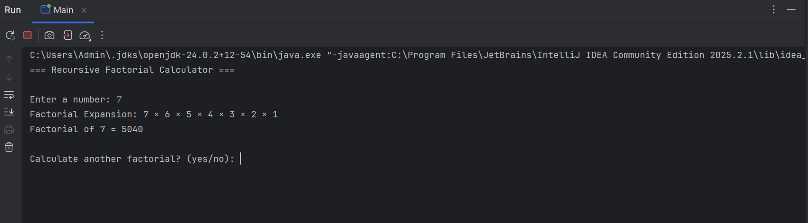

# Factorial Calculator (Recursion)

## Description
This project calculates factorial using recursion in Java.

## Features
- Recursive factorial computation
- Handles negative numbers
- Displays factorial expansion
- Input validation

## Concepts Used
- Recursion
- Object-Oriented Programming
- Exception Handling
- User Input Handling

## Sample Output

