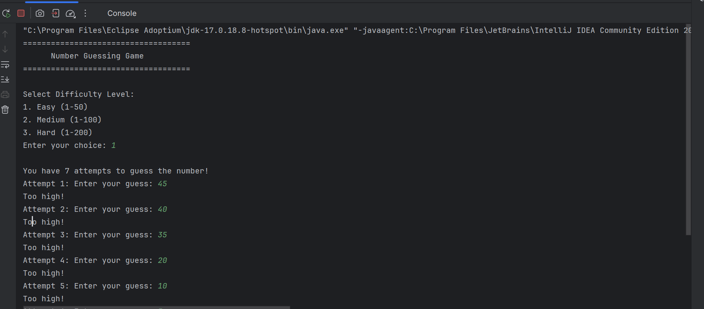
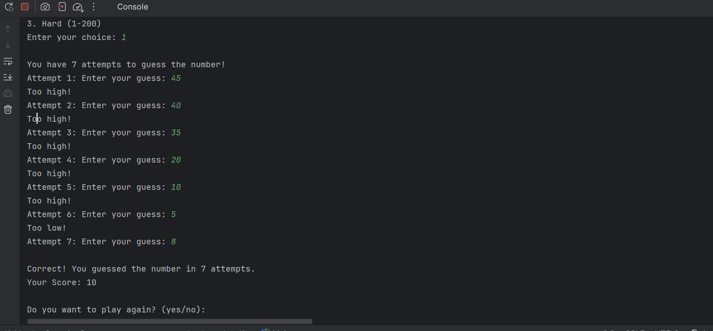

# Number Guessing Game (Java Console Application)

## Description
This project is part of my Java Development Internship at Codveda Technologies.

It is a console-based number guessing game built using Object-Oriented Programming principles.

## Features
- Multiple difficulty levels (Easy, Medium, Hard)
- Limited attempts system
- Score calculation
- Replay functionality
- Input validation for invalid entries

## Concepts Used
- OOP (Object-Oriented Programming)
- Random number generation
- Loops and conditionals
- Input validation
- Clean method structuring

## Sample Output

Below is a sample run of the application:

